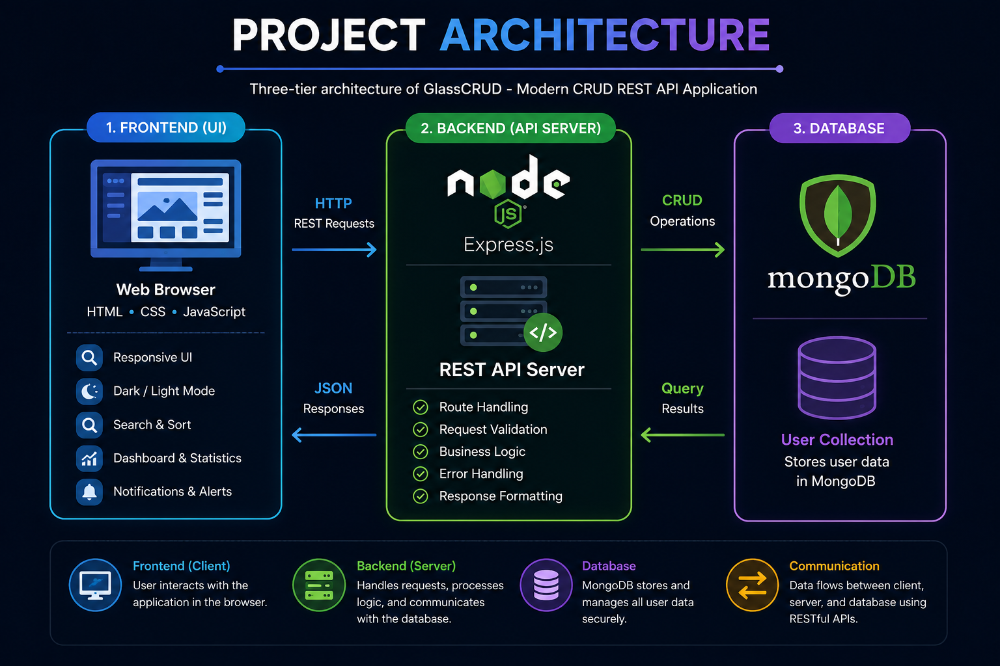

<h1 align="center">
  GlassCRUD - Modern CRUD REST API Application
</h1>

<p align="center">
  
</p>

<p align="center">
  ***A Modern Full-Stack CRUD REST API Application with a Responsive Glassmorphism Dashboard***
</p>

<p align="center">

  

  

  

  

  

  

  

</p>

<p align="center">

  

  

  

  

  

  

</p>

---

## 📑 Table of Contents

- [Project Overview](#-project-overview)
- [Key Features](#-key-features)
- [Technology Stack](#️-technology-stack)
- [Project Architecture](#️-project-architecture)
- [Repository Structure](#-repository-structure)
- [Application Screenshots](#-application-screenshots)
- [REST API Endpoints](#-rest-api-endpoints)
- [Getting Started](#-getting-started)
- [Installation](#️-installation)
- [Running the Application](#️-running-the-application)
- [Future Enhancements](#️-future-enhancements)
- [Author](#-author)
- [License](#-license)

---

# 📌 Project Overview 

**GlassCRUD - Modern CRUD REST API Application** is a modern, responsive, and full-stack web application that demonstrates the implementation of **RESTful APIs** through complete **CRUD (Create, Read, Update, Delete)** operations for efficient user management. 

Designed with a sleek **Glassmorphism** interface, the application delivers a clean and interactive user experience while maintaining a robust backend powered by **Node.js**, **Express.js**, **MongoDB**, and **Mongoose**. The frontend is built using **HTML5**, **CSS3**, and **JavaScript**, resulting in a fast, responsive, and intuitive dashboard. 

The application follows **REST architecture** to enable seamless client-server communication through well-structured API endpoints while supporting complete **CRUD** operations. With features like search, sorting, responsive design, dark/light mode, toast notifications, confirmation dialogs, and real-time dashboard statistics, it showcases clean architecture, modern UI/UX, and industry-standard full-stack development practices.

---

# ✨ Key Features

- ✅ Complete **CRUD (Create, Read, Update, Delete)** functionality
- ✅ RESTful API implementation using Express.js
- ✅ User Management System with seamless data operations
- ✅ Modern and responsive **Glassmorphism** user interface
- ✅ Dark and Light theme support
- ✅ Real-time search functionality
- ✅ Dynamic data sorting
- ✅ Interactive dashboard with live statistics
- ✅ User-friendly create and edit forms
- ✅ Delete confirmation modal for secure record removal
- ✅ Toast notifications for user feedback
- ✅ Skeleton loading animation
- ✅ Empty state handling
- ✅ Toggle between Card View and Table View
- ✅ Automatic SVG user avatar generation
- ✅ Fully responsive design for desktop, tablet, and mobile devices
- ✅ Fast client-server communication using the Fetch API
- ✅ MongoDB integration with Mongoose ODM
- ✅ Clean and scalable full-stack project architecture

---

# 🛠️ Technology Stack

| Category | Technologies |
|----------|--------------|
| **Frontend** | HTML5, CSS3, JavaScript |
| **Backend** | Node.js, Express.js |
| **Database** | MongoDB, Mongoose |
| **API** | RESTful API |
| **Communication** | Fetch API |
| **Development Tools** | MongoDB Compass, Git, GitHub, Visual Studio Code |
| **Package Manager** | npm |

---

# 🏗️ Project Architecture

The application follows a **three-tier architecture** consisting of a responsive frontend, a RESTful backend, and a MongoDB database. The frontend communicates with the backend through REST API endpoints, while the backend processes requests, performs database operations using Mongoose, and returns JSON responses to the client.
<p align="center"> 
   
</p>
---

# 📂 Repository Structure

```
Modern-CRUD-REST-API-Application/
│
├── assets/
│   ├── banner.png
│   ├── logo.png
│   ├── home.png
│   ├── create-user.png
│   ├── update-user.png
│   ├── delete-confirmation.png
│   ├── delete-success.png
│   └── mongodb.png
│
├── backend/
│   ├── server.js
│   ├── package.json
│   └── package-lock.json
│
├── frontend/
│   ├── CRUD.html
│   ├── styles.css
│   └── script.js
│
├── .gitignore
├── LICENSE
└── README.md

```
