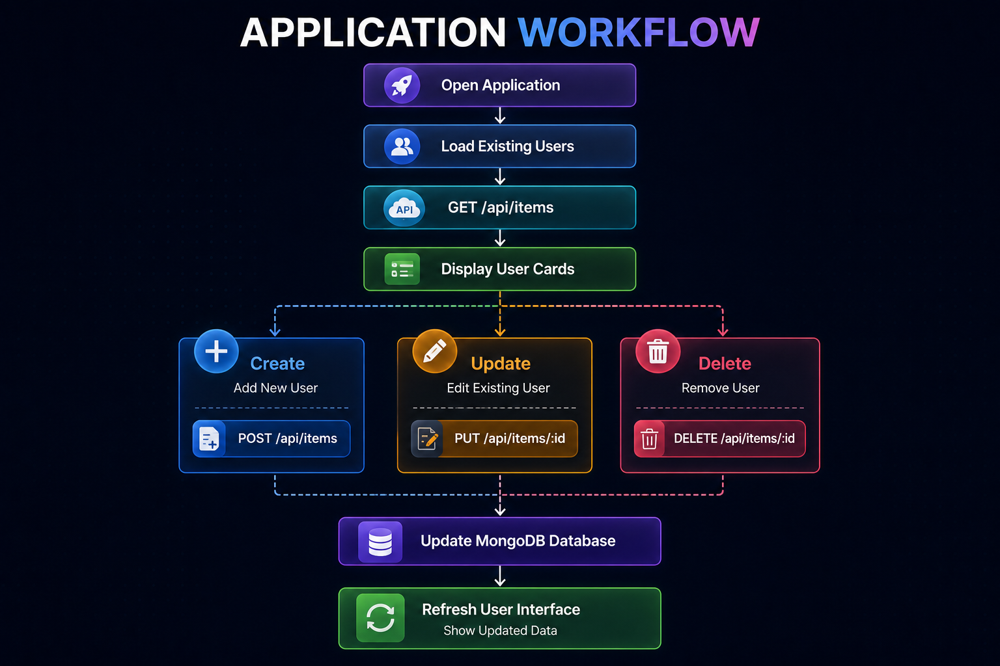
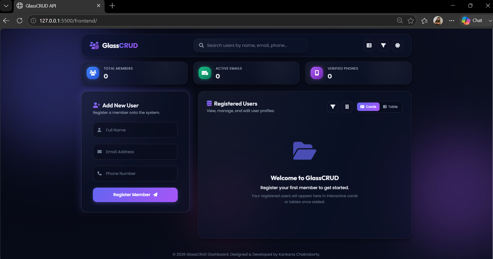
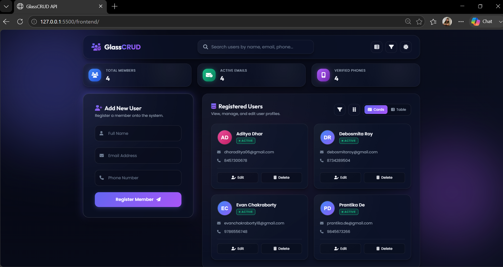
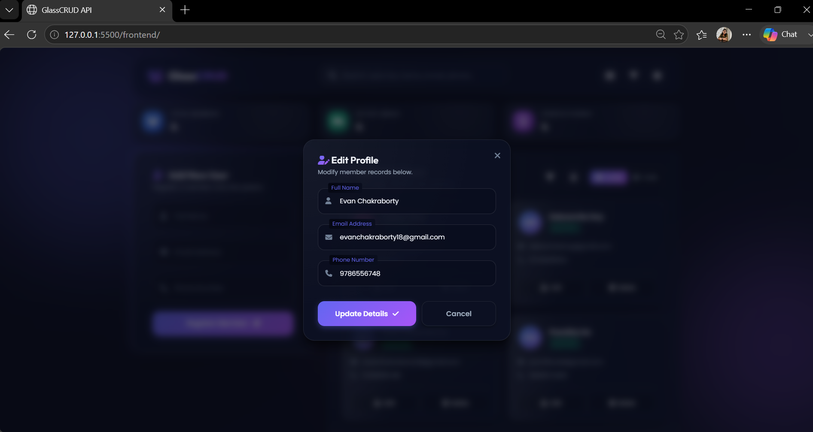
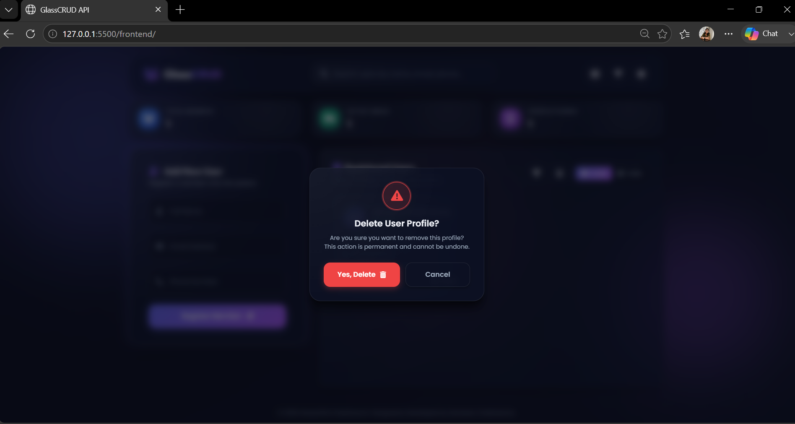
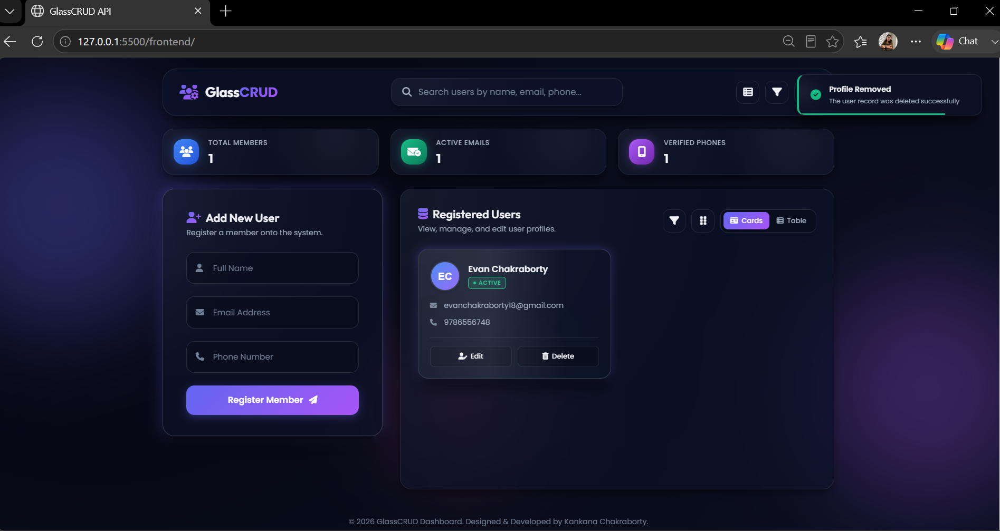
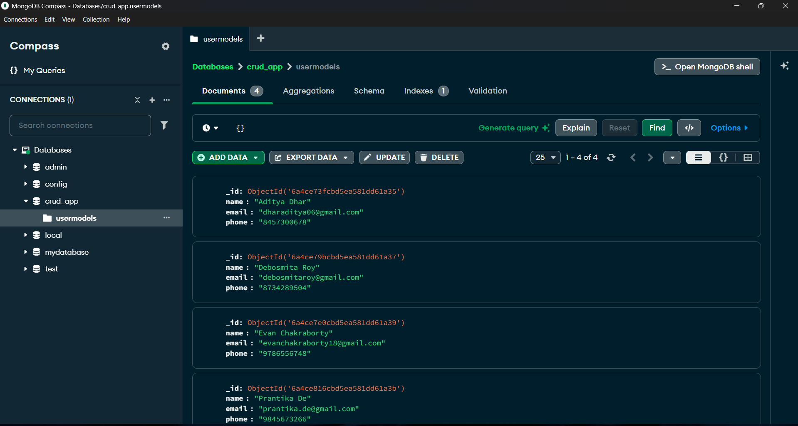

<h1 align="center">
  GlassCRUD - Modern CRUD REST API Application
</h1>

<p align="center">
  
</p>

<p align="center">
  ***A Modern Full-Stack CRUD REST API Application with a Responsive Glassmorphism Dashboard***
</p>

<p align="center">

  

  

  

  

  

  

  

</p>

<p align="center">

  

  

  

  

  

  

</p>

---

## 📑 Table of Contents

- [Project Overview](#-project-overview)
- [Key Features](#-key-features)
- [Technology Stack](#️-technology-stack)
- [Project Architecture](#️-project-architecture)
- [Repository Structure](#-repository-structure)
- [Application Workflow](#-application-workflow)
- [REST API Request Flow](#-rest-api-request-flow)
- [Application Screenshots](#-application-screenshots)
- [REST API Endpoints](#-rest-api-endpoints)
- [Getting Started](#-getting-started)
- [Installation](#️-installation)
- [Running the Application](#️-running-the-application)
- [Future Enhancements](#️-future-enhancements)
- [Author](#-author)
- [License](#-license)

---

# 📌 Project Overview 

**GlassCRUD - Modern CRUD REST API Application** is a modern, responsive, and full-stack web application that demonstrates the implementation of **RESTful APIs** through complete **CRUD (Create, Read, Update, Delete)** operations for efficient user management. 

Designed with a sleek **Glassmorphism** interface, the application delivers a clean and interactive user experience while maintaining a robust backend powered by **Node.js**, **Express.js**, **MongoDB**, and **Mongoose**. The frontend is built using **HTML5**, **CSS3**, and **JavaScript**, resulting in a fast, responsive, and intuitive dashboard. 

The application follows **REST architecture** to enable seamless client-server communication through well-structured API endpoints while supporting complete **CRUD** operations. With features like search, sorting, responsive design, dark/light mode, toast notifications, confirmation dialogs, and real-time dashboard statistics, it showcases clean architecture, modern UI/UX, and industry-standard full-stack development practices.

---

# ✨ Key Features

- ✅ Complete **CRUD (Create, Read, Update, Delete)** functionality
- ✅ RESTful API implementation using Express.js
- ✅ User Management System with seamless data operations
- ✅ Modern and responsive **Glassmorphism** user interface
- ✅ Dark and Light theme support
- ✅ Real-time search functionality
- ✅ Dynamic data sorting
- ✅ Interactive dashboard with live statistics
- ✅ User-friendly create and edit forms
- ✅ Delete confirmation modal for secure record removal
- ✅ Toast notifications for user feedback
- ✅ Skeleton loading animation
- ✅ Empty state handling
- ✅ Toggle between Card View and Table View
- ✅ Automatic SVG user avatar generation
- ✅ Fully responsive design for desktop, tablet, and mobile devices
- ✅ Fast client-server communication using the Fetch API
- ✅ MongoDB integration with Mongoose ODM
- ✅ Clean and scalable full-stack project architecture

---

# 🛠️ Technology Stack

| Category | Technologies |
|----------|--------------|
| **Frontend** | HTML5, CSS3, JavaScript |
| **Backend** | Node.js, Express.js |
| **Database** | MongoDB, Mongoose |
| **API** | RESTful API |
| **Communication** | Fetch API |
| **Development Tools** | MongoDB Compass, Git, GitHub, Visual Studio Code |
| **Package Manager** | npm |

---

# 🏗️ Project Architecture

<p align="center"> 
   
</p>

The application follows a **three-tier architecture** consisting of a responsive frontend, a RESTful backend, and a MongoDB database. The frontend communicates with the backend through REST API endpoints, while the backend processes requests, performs database operations using Mongoose, and returns JSON responses to the client.

---

# 📂 Repository Structure

```
Modern-CRUD-REST-API-Application/
│
├── assets/
│   ├── banner.png
│   ├── logo.png
│   ├── home.png
│   ├── create-user.png
│   ├── update-user.png
│   ├── delete-confirmation.png
│   ├── delete-success.png
│   └── mongodb.png
│
├── backend/
│   ├── server.js
│   ├── package.json
│   └── package-lock.json
│
├── frontend/
│   ├── CRUD.html
│   ├── styles.css
│   └── script.js
│
├── .gitignore
├── LICENSE
└── README.md

```
---

# 🔄 Application Workflow

<p align="center"> 
   
</p>

---

# 🔌 REST API Request Flow

The application follows a **RESTful request-response lifecycle**, where the frontend communicates with the backend using HTTP methods. The Express.js server validates incoming requests, performs CRUD operations through Mongoose, interacts with MongoDB, and returns JSON responses that dynamically update the user interface.

```
Frontend
    │
    │  Fetch API
    ▼
Node.js + Express.js
    │
    │  Mongoose
    ▼
MongoDB
    │
    ▼
JSON Response
    │
    ▼
Frontend Updates UI

```
# 📸 Application Screenshots

## 🏠 Home Page

Displays all user records with live statistics, search, sorting, and responsive card/table views.

<p align="center">

</p>

---

## ➕ Create User

Add new user records through a clean and intuitive form with real-time validation.

<p align="center">

</p>

---

## ✏️ Update User

Modify existing user information quickly using the interactive update modal.

<p align="center">

</p>

---

## 🗑 Delete Confirmation

Before removing a record, the application displays a confirmation dialog to prevent accidental deletion.

<p align="center">

</p>

---

## ✅ Delete Success

Receive instant visual feedback after successfully deleting a user record.

<p align="center">

</p>

---

## 🗄 MongoDB Database

All user records are stored in MongoDB using Mongoose. Each document contains the user's name, email, and phone number.

<p align="center">

</p>

---

# 🔌 REST API Endpoints

The application exposes a RESTful API for performing complete **CRUD (Create, Read, Update, Delete)** operations on user records.

| Method | Endpoint | Description |
|:------:|:---------|:------------|
| **GET** | `/api/users` | Retrieve all user records. |
| **POST** | `/api/users` | Create a new user record. |
| **PUT** | `/api/users/:id` | Update an existing user by its unique ID. |
| **DELETE** | `/api/users/:id` | Delete a user by its unique ID. |

## 📋 API Summary

| Operation | HTTP Method | Endpoint |
|-----------|:-----------:|----------|
| Read All Users | `GET` | `/api/users` |
| Create User | `POST` | `/api/users` |
| Update User | `PUT` | `/api/users/:id` |
| Delete User | `DELETE` | `/api/users/:id` |

> **Base URL:** `http://localhost:3000/api/users`

---

# 📨 API Request Examples

## 1️⃣ 📥 Get All Users

**Request**

```http
GET /api/users
```

**Response**

```json
[
  {
    "_id": "689c1234567890abcdef1234",
    "name": "John Doe",
    "email": "john@example.com",
    "phone": "9876543210"
  }
]
```

---

## 2️⃣ ➕ Create User

**Request**

```http
POST /api/users
Content-Type: application/json
```

```json
{
  "name": "John Doe",
  "email": "john@example.com",
  "phone": "9876543210"
}
```

**Response**

```json
{
  "_id": "689c1234567890abcdef1234",
  "name": "John Doe",
  "email": "john@example.com",
  "phone": "9876543210"
}
```

---

## 3️⃣ ✏️ Update User

**Request**

```http
PUT /api/users/689c1234567890abcdef1234
Content-Type: application/json
```

```json
{
  "name": "John Smith",
  "email": "johnsmith@example.com",
  "phone": "9876543210"
}
```

**Response**

```json
{
  "_id": "689c1234567890abcdef1234",
  "name": "John Smith",
  "email": "johnsmith@example.com",
  "phone": "9876543210"
}
```

---

## 4️⃣ 🗑️ Delete User

**Request**

```http
DELETE /api/users/689c1234567890abcdef1234
```

**Response**

```json
{
  "message": "User deleted successfully."
}
```
---

# 🚀 Getting Started

Follow these steps to set up and run the project on your local machine.

## Prerequisites

Ensure the following software is installed before running the application.

- Node.js (v18 or later recommended)
- npm (comes with Node.js)
- MongoDB Community Server
- MongoDB Compass (Optional)
- Git

---

# 📦 Installation

Follow the steps to install the repository.

## Clone the Repository

```bash
git clone https://github.com/Bijoy781999/CRUD-REST-API-Management-System.git
```

Move into the project directory.

```bash
cd CRUD-REST-API-Management-System
```

---

## Install Dependencies

Navigate to the backend directory.

```bash
cd backend
```

Install all required npm packages.

```bash
npm install
```

---

## Start MongoDB

Make sure your local MongoDB service is running before starting the server.

Default connection used in this project:

```text
mongodb://localhost:27017/crudDb
```

---

# 🚀 Running the Application

Ready to use the CRUD-API.

## Start the Backend Server

Inside the **backend** directory, start the Express server.

```bash
node server.js
```

If everything is configured correctly, you should see a message similar to:

```text
Server running on http://localhost:5000
Connected to MongoDB
```

---

## Launch the Frontend

Open the **frontend** folder and launch:

```text
CRUD.html
```

You can:

- Double-click the file to open it in your browser, or
- Use the VS Code Live Server extension for a better development experience.

The frontend communicates with the backend using the Fetch API.

---

# 📦 Backend Dependencies

The project uses the following npm packages.

| Package | Purpose |
|----------|---------|
| Express.js | Backend web framework |
| Mongoose | MongoDB object modeling |
| CORS | Enable cross-origin requests |
| Dotenv* | Environment variable support (optional for future enhancements) |

> **Note:** The current project connects directly to the local MongoDB URI. `dotenv` can be used in future versions to move configuration values into environment variables.

---

# 💾 Database Configuration

The application stores all user records in MongoDB.

**Database Name**

```text
crudDb
```

**Collection**

```text
items
```

Each document contains:

```json
{
  "_id": "...",
  "name": "John Doe",
  "email": "john@example.com",
  "phone": "9876543210"
}
```

Mongoose automatically generates the unique `_id` for every document.

---

# 🚀 Future Enhancements

The project is continuously evolving with the goal of becoming a feature-rich and production-ready user management system. Planned improvements include:

- 🔐 JWT Authentication & Authorization
- 👥 Role-Based Access Control (RBAC)
- ☁️ MongoDB Atlas Cloud Database Integration
- 📄 Pagination for Large Datasets
- 📤 Export Data to CSV, Excel, and PDF
- 📊 Interactive Dashboard Analytics
- 📸 Profile Image Upload Support
- 📧 Email Verification & Notifications
- 🔍 Advanced Filtering & Search
- 📱 Progressive Web App (PWA) Support
- 🐳 Docker Containerization
- 🚀 Deployment on Render, Vercel, or Railway
- 🧪 Automated Testing using Jest & Supertest
- 📘 Swagger/OpenAPI Documentation
- ⚙️ Environment Variable Configuration
- 🔒 Enhanced Security & Input Validation

---

# 🤝 Contributing

Contributions are always welcome!

If you'd like to improve this project, feel free to:

1. 🍴 Fork the repository.
2. 🌿 Create a new feature branch.
3. 💻 Make your changes.
4. ✅ Commit your updates with meaningful messages.
5. 🚀 Push your branch.
6. 🔁 Open a Pull Request.

Please ensure your code follows clean coding practices and maintains consistency with the existing project structure.

---

# 👤 Author

### Kankana Chakraborty

**AI/ML Engineer • Full-Stack Developer • Generative AI Enthusiast**

Passionate about building modern full-stack applications, scalable REST APIs, intelligent AI solutions, and creating user-friendly software with clean architecture and elegant user experiences.

- 💼 GitHub: https://github.com/Kankana1012
- 💼 LinkedIn: https://www.linkedin.com/in/kankana-chakraborty
- 📧 Email: lushichakraborty@gmail.com

---

# 📜 License

This project is licensed under the **MIT License**.

You are free to use, modify, and distribute this project in accordance with the terms of the MIT License.

For more details, please refer to the **LICENSE** file included in this repository.

---

# 🙏 Acknowledgements

Special thanks to the amazing open-source community and the technologies that made this project possible.

- ❤️ HTML5
- 🎨 CSS3
- ⚡ JavaScript
- 🚀 Node.js
- 🌐 Express.js
- 🍃 MongoDB
- 📦 Mongoose
- 💻 Visual Studio Code
- 🛠️ Git & GitHub

Their powerful tools and continuous innovation have greatly contributed to the development of this project.

---

# 💖 Support

If you found this project helpful or learned something new from it, consider supporting it by:

⭐ **Starring this repository**

🍴 **Forking the project**

📢 **Sharing it with others**

🤝 **Contributing new features or improvements**

Every star, contribution, and piece of feedback helps make this project even better.

<h3 align="center">
⭐ Thank you for visiting this repository! ⭐
</h3>

<p align="center">
If you like this project, don't forget to leave a ⭐ on GitHub!
</p>

